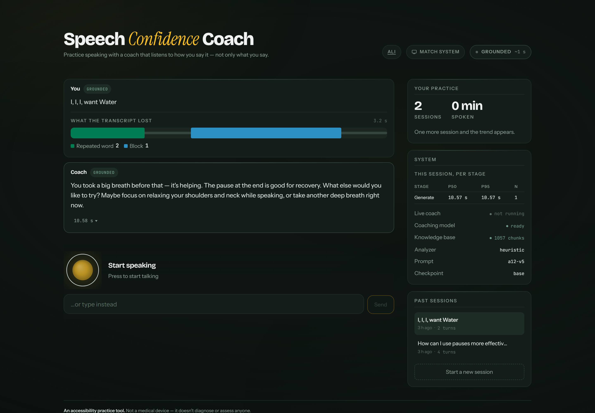
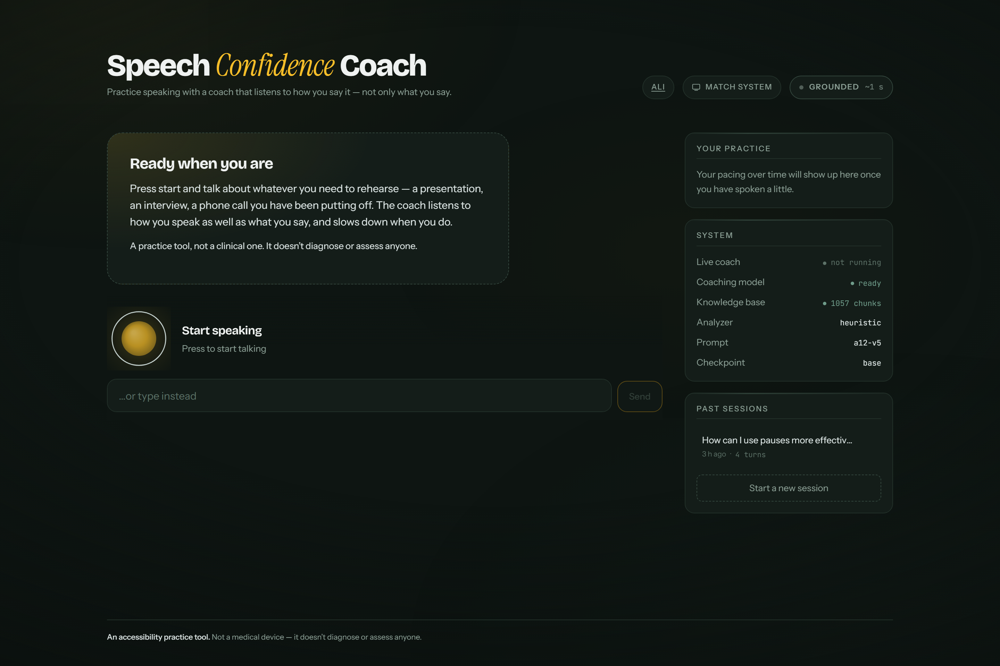
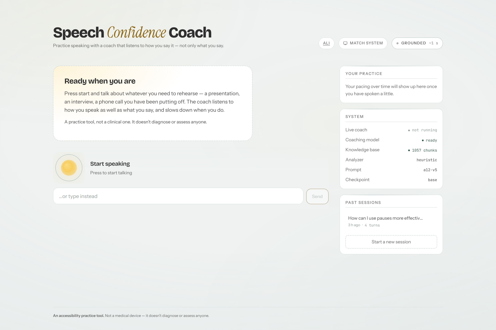
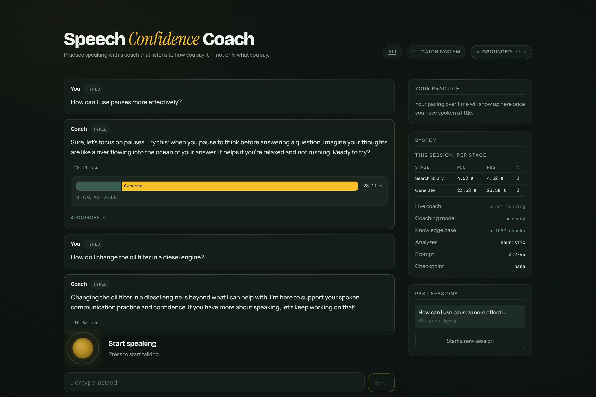
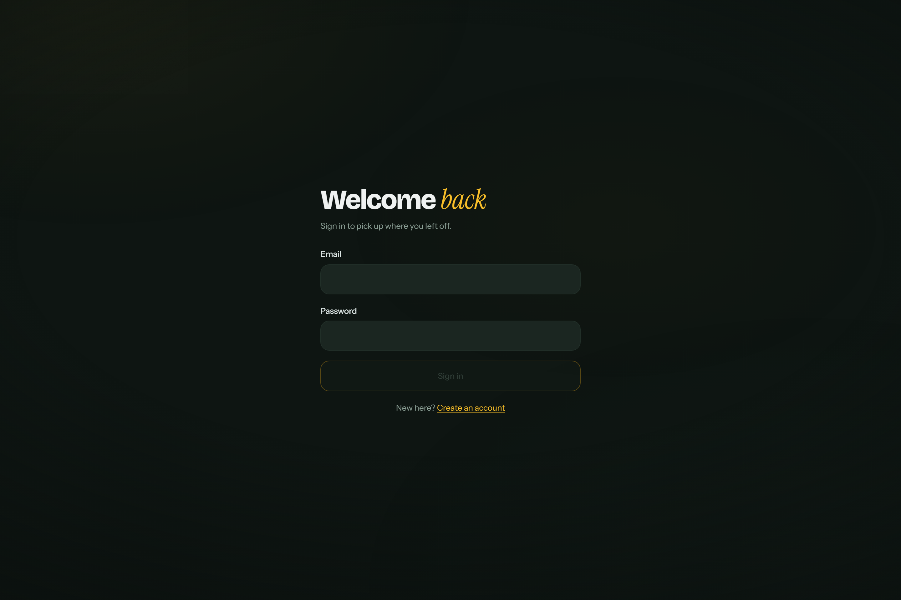

<div align="center">

# Speech Confidence Coach

**A speaking coach that listens to *how* you say it — not only *what* you say.**

Practice pacing, fluency techniques, and delivery in a low-pressure spoken
conversation with an AI that can hear a block, a repetition, or a rush — and
slows down when you do.

`Native S2S` · `FastAPI` · `React 18` · `Whisper` · `RAG` · `Local LLM` · `Runs offline`

</div>

---

## The one-minute version

Every voice assistant you have used transcribes your speech to text before it
thinks about it. For most people that is fine. For someone who stammers, it is
the difference between being heard and being flattened.

Here is a real utterance, run through this project's own verification harness.
The transcript is what a conventional pipeline keeps. Everything else is what
it throws away.



The speaker paused for **1.5 seconds** mid-sentence. The transcript contains no
trace of it — not a comma, not an ellipsis, nothing. The coach's reply
(*"You took a big breath before that — it's helping"*) exists only because a
second branch of the pipeline measured the audio instead of reading the text.

That branch is the project.

---

## Why this is built the way it is

The obvious architecture is a cascade: speech → text → model → speech. It is
also the architecture that causes the problem above. So this project runs
**two paths over the same audio**, and the comparison between them is the
result:

| | Live Coach | Grounded Knowledge |
|---|---|---|
| **Model** | Quantized Moshi (native speech-to-speech) | Whisper → analyzer → RAG → LLM → TTS |
| **Latency** | ~200 ms, full-duplex | ~10–28 s warm on a local 3B |
| **Hears dysfluency?** | Yes — natively, from audio tokens | Yes — via a parallel acoustic branch |
| **Can cite sources?** | No. Structurally cannot. | Yes, with a groundedness gate |
| **Placement** | GPU, resident | CPU |

Native S2S is the flagship because it removes the text bottleneck by design.
That same design is why it has no prompt surface, no retrieval injection point,
and nothing to fine-tune — so the cascade is not a fallback bolted on, it is
where grounded coaching content has to come from. Each path does the thing the
other structurally cannot.

The acoustic branch is the hinge. It **forks the raw audio** before Whisper ever
sees it, so the cascade gets dysfluency awareness that a text pipeline cannot
produce on its own.

```
                     ┌──────────────┐
                     │  User audio  │
                     └──────┬───────┘
              ┌─────────────┴─────────────┐
              │                           │
      ╔═══════▼═══════╗          ╔════════▼═════════╗
      ║  LIVE COACH   ║          ║    GROUNDED      ║
      ║  ~200 ms GPU  ║          ║  ~seconds, CPU   ║
      ╚═══════╤═══════╝          ╚════════╤═════════╝
              │                           │
      Mimi codec → Moshi 7B q4    ┌────────┴────────┐
      full-duplex, barge-in       │                 │
              │              Whisper base    Acoustic branch
      Inner Monologue text        │        (raw audio, forked)
              │                   └────────┬────────┘
              │              prompt a12-v5 + <acoustic_context>
              │                            │
              │              RAG · bge-small · Chroma · 1057 chunks
              │                            │
              │              Qwen2.5-3B Q4_K_M (llama.cpp)
              │                            │
              │              Kokoro TTS, rate driven by fluency load
              └─────────────┬──────────────┘
                Shared session state · SQLite · per-turn metrics
```

---

## What it looks like

The interface is deliberately calm. People using it are already anxious about
performing, so there are no shake animations, no red alarms, and no scores.

| Dark — the default room | Light — the same layout, re-lit |
|---|---|
|  |  |

### Every number is checkable

No latency claim in this project is an estimate. Expand any coach turn and it
shows exactly where its time went, stage by stage, measured on that turn:



Two things worth noticing in that screenshot:

1. **The generate stage dominates** — 28.11 s of a 28.11 s turn. On a
   CPU-served 3B, the LLM *is* the latency. That is the honest number, and it is
   the whole argument for the ~200 ms native path sitting beside it.
2. **The second question was refused.** *"How do I change the oil filter in a
   diesel engine?"* returned a graceful decline, not a hallucination — the
   groundedness gate found nothing in the corpus above threshold.

### Sign-in



Accounts exist because practice transcripts are personal. **Audio is never
stored.** Transcripts are, so you can look back at them — and you can export or
delete everything at any time.

---

## Measured results

Everything below is reproduced by a script in this repo. None of it is asserted.

### The central claim, under test

`backend/scripts/verify_acoustic_branch.py` splices a dysfluent utterance from
real synthesized speech with **known ground truth** — `"I ... I ... I want
[1400 ms block] water please"` — and runs it through the production path.

| Ground truth | Recovered | Error |
|---|---|---|
| Block of **1400 ms** | 1500 ms | 100 ms |
| Block **at 1345 ms** | located at 1200 ms | 145 ms |
| Utterance 3157 ms | 3158 ms | 1 ms |
| Word repetition | detected | — |

Whisper's transcript for that same audio: `"I, I, I, want Water"`. The block is
**absent from it entirely**. Eight assertions, all passing.

### Choosing Whisper by the right metric

The analyzer measures block duration from Whisper's *word timestamps*, so the
model was chosen on timing accuracy, not on transcript quality — a distinction
that changed the answer:

| Model | Block measured | Verdict |
|---|---|---|
| `tiny` | — | **Missed the 1400 ms block entirely** |
| `base` | 1440 ms | 40 ms error — shipped |
| `small` | 1460 ms | 60 ms error, ~3.4× slower for 20 ms |

`tiny` would have silently erased the signal the project exists to detect.

### The groundedness gate

Retrieval similarity for questions inside and outside the corpus:

| | min | mean | max |
|---|---|---|---|
| In corpus (10 questions) | 0.696 | — | 0.814 |
| Out of corpus (8 questions) | 0.434 | 0.532 | 0.619 |

Threshold set at **0.65** — inside the 0.077 gap and deliberately nearer the
out-of-corpus side, because the errors are not symmetric: inventing coaching
advice is worse than declining to give it.

**Result: 0 of 8 out-of-corpus questions answered. 0 of 10 in-corpus questions
refused.**

> A tuning note worth recording: on synthetic fixtures the gate looked correct
> at 0.55. Against the real 1057-chunk corpus, 0.55 would have answered **3 of
> the 8** questions it should have refused. Fixture-tuned thresholds do not
> survive contact with real data.

---

## Quickstart

**Prerequisites:** Python 3.11, Node 20+, and a GGUF chat model served over an
OpenAI-compatible endpoint (llama.cpp's `llama-server` is what this was built
against). No GPU is required for the cascade path.

```bash
git clone https://github.com/Ali-Khamis45/we-s2s-finalproject.git
cd we-s2s-finalproject
```

**1 — Backend**

```bash
cd backend
python -m venv .venv && source .venv/bin/activate    # Windows: .venv/Scripts/activate
pip install -r requirements.txt

export SCC_JWT_SECRET=$(python -c "import secrets; print(secrets.token_urlsafe(48))")
python scripts/fetch_corpus.py                       # builds the knowledge base
uvicorn app.main:app --reload --port 8000
```

The server **refuses to boot** without a `SCC_JWT_SECRET` of at least 32 bytes
outside debug mode. That is deliberate — a default signing key is not a
convenience, it is an authentication bypass.

**2 — The coaching model** (separate terminal)

```bash
llama-server -m qwen2.5-3b-instruct-q4_k_m.gguf --port 8080 -c 4096
```

**3 — Frontend** (separate terminal)

```bash
cd frontend
npm install
npm run dev            # http://localhost:5173
```

Create an account, press **Start speaking**, and talk.

> **Not yet included:** a `docker compose up` path and CI badges. Both are
> planned; neither exists yet, so neither is promised here.

---

## Verify it yourself

Every claim above has a script behind it. From `backend/`:

```bash
python scripts/verify_acoustic_branch.py scripts/words   # the central claim
python scripts/verify_cascade.py                         # end-to-end pipeline
python scripts/verify_retrieval.py                       # grounding + refusals
python scripts/calibrate_gate.py                         # re-derive the threshold
python scripts/bench_whisper.py                          # word-timestamp accuracy
python scripts/bench_latency.py <wav> 5                  # per-stage p50/p95
```

Or through the Makefile, which wraps the whole lot (`scripts/make.ps1` is the
PowerShell equivalent — same target names):

```bash
make test           # 80 backend tests + 41 frontend tests
make lint           # Ruff and TypeScript, strict
make check-types    # fails if the committed schema or types are stale
make bench          # full verification run (needs models and a served LLM)
make help           # every target
```

The frontend's API types are **generated from the backend's OpenAPI schema**
(`make types`), and `make check-types` fails the build if the committed schema
drifts from the running app. A backend field rename breaks the frontend build
instead of breaking it at runtime.

---

## Engineering notes

A few decisions that took more than one attempt, kept here because the second
answer is usually the interesting one.

**Dysfluency dominance is weighted by time, not by count.** The first
implementation picked the most *frequent* event, so three short repetitions
outvoted a 1.5-second block — and the coach responded to the wrong thing. It
now weights by the duration each event occupies.

**The model was reading its own citations aloud.** Prompt `a12-v4` put
retrieved passages in the user message with `[1]` markers; through TTS, users
heard *"one, The Art of Public Speaking"*. `a12-v5` moved reference material to
the system message and dropped the markers. Prompts are versioned, and the
version is visible in the UI.

**The palette in the design brief failed accessibility validation.** Block and
prolongation sat at ΔE 10.1 under deuteranopia simulation, below the 15 floor —
two dysfluency types would have been indistinguishable to a colour-blind user
looking at a colour-coded timeline. Replaced with Okabe-Ito derivatives
re-placed inside an OKLCH lightness band, then validated across all pairs.

**Reduced motion left content invisible.** `animation-fill-mode: backwards`
plus a delay means an element renders in its *start* state until the delay
elapses. The reduced-motion media query zeroed `duration` but not `delay`, so
staggered content simply never appeared. Duration alone is not enough.

**A structured-logging field silently broke every error response.**
`logger.info(..., extra={"msg": ...})` collides with a reserved `LogRecord`
attribute and raises — inside the error handler. Every 404 and 503 became an
unhandled 500. Reserved keys are now renamed before they reach the logger.

---

## Security & privacy

- **argon2id** password hashing at OWASP-recommended parameters
- **JWT access tokens (10 min)** with opaque rotating refresh tokens and
  **token-family reuse detection** — a replayed refresh token revokes the family
- **NIST 800-63B** password policy: length over composition rules
- **User-enumeration resistant** sign-in, with timing equalized across the
  known-user and unknown-user paths
- **WebSockets authenticate via 30-second single-use tickets**, never a token in
  a query string, which would land in server logs
- Another account's session returns **404, not 403** — a 403 confirms the
  resource exists
- **Audio is never persisted.** Transcripts are, scoped to their owner, with
  export and delete
- Runs **fully offline**: no third-party API keys, no telemetry, no egress

Full scope boundaries and data handling: [`docs/ETHICS.md`](docs/ETHICS.md).

---

## Repository

```
backend/     FastAPI · async SQLAlchemy · orchestrator · RAG · prompts
  app/schemas/acoustic.py    the acoustic-tag contract between both tracks
  app/core/config.py         every default carries the measurement behind it
  scripts/                   verification and benchmark harnesses
frontend/    React 18 · TypeScript · Vite · WebGL ambient surface
  src/components/DysfluencyTimeline.tsx   the centerpiece visual
  src/lib/api-types.gen.ts                generated from the OpenAPI schema
data/corpus/ knowledge base with per-source provenance
docs/        plan · protocol · report · demo script · ethics
design/      design system, motion spec, colour validation
ml/          Track M — training, quantization, evaluation
```

| Document | What's in it |
|---|---|
| [`docs/PROJECT_PLAN.md`](docs/PROJECT_PLAN.md) | Architecture, VRAM budget, task split, risks |
| [`docs/PROTOCOL.md`](docs/PROTOCOL.md) | WebSocket framing and error codes |
| [`docs/REPORT.md`](docs/REPORT.md) | Method, measurements, limitations |
| [`docs/DEMO.md`](docs/DEMO.md) | Walkthrough script |
| [`docs/ETHICS.md`](docs/ETHICS.md) | Scope boundaries and data handling |
| [`backend/scripts/README.md`](backend/scripts/README.md) | Every measurement, and how to reproduce it |

---

## Limitations

Stated plainly, because they will be asked about.

- **Moshi is English-only**, and it is **not instruction-followable** — there is
  no system prompt. The coaching persona has to come from a LoRA adapter on its
  backbone, or the substantive content has to arrive through the cascade.
- **The shipped dysfluency analyzer is heuristic**, working from Whisper word
  timings and prosody. The wav2vec2 classifier trained on SEP-28k is Track M's
  deliverable; the schema between them is frozen, so it drops in without a
  frontend change.
- **The cascade is slow** — seconds, not the sub-second the original plan
  estimated. The measurement replaced the estimate, and it widens the gap the
  comparison exists to show.
- **The corpus is English and non-clinical by design.** Out-of-scope questions
  are refused rather than answered.

---

## Scope

This is an **accessibility and communication-practice tool**. It is not a
medical device. It does not diagnose, assess, or provide clinical speech
therapy, and it uses no diagnostic language anywhere in its interface or
corpus.

Built as a graduation project. Track A (product, application, RAG, prompting,
frontend, integration) and Track M (models, training, quantization, evaluation)
are split between two authors — see [`docs/PROJECT_PLAN.md`](docs/PROJECT_PLAN.md).
