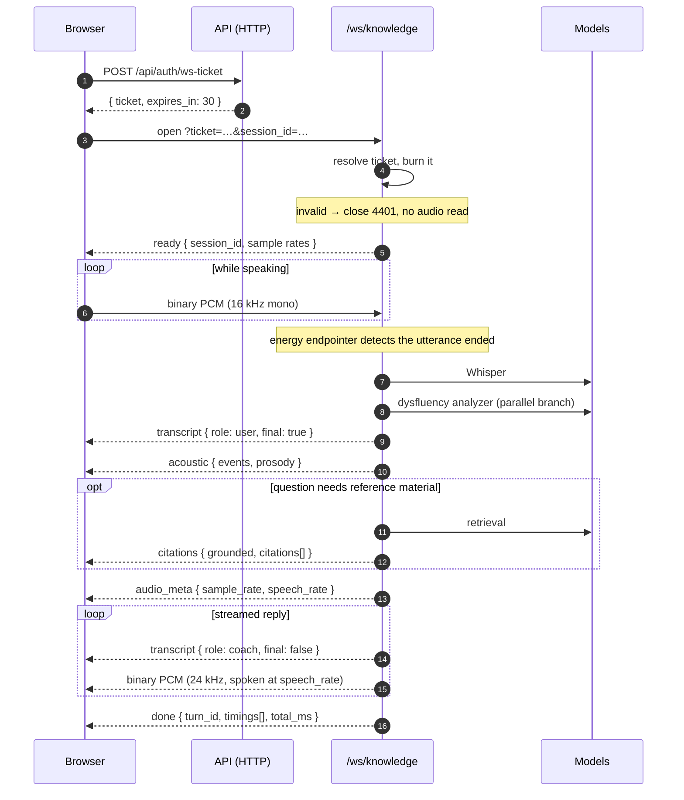

# WebSocket Protocol

Two sockets carry the conversation. Both authenticate the same way, both mix
JSON control frames with binary audio, and both are defined in exactly one
place: [`frontend/src/lib/protocol.ts`](../frontend/src/lib/protocol.ts).

| Socket | Path | Carries |
|---|---|---|
| Live Coach | `/ws/live` | Full-duplex native speech-to-speech, ~200 ms |
| Grounded Knowledge | `/ws/knowledge` | The cascade — STT, retrieval, LLM, TTS |

---

## Authentication

A browser `WebSocket` cannot send an `Authorization` header, and a token in the
query string is written into every access log, proxy log, and browser history
entry. So neither socket accepts a JWT. Instead:

1. `POST /api/auth/ws-ticket` over authenticated HTTP returns an opaque ticket.
2. The client opens `wss://…/ws/knowledge?ticket=…&session_id=…`.
3. The server resolves the ticket, **burns it**, and only then reads anything.

Tickets are single-use and expire after **30 seconds**. Missing, unknown,
expired, or already-used all close with **4401** — before a single audio frame
is read, and without distinguishing which, since the client has no legitimate
use for knowing.

Fetch a fresh ticket on every connect. Never cache one.

---

## A knowledge turn, end to end



`speech_rate` on `audio_meta` is set from the speaker's own acoustic profile: a
long block slows the coach's delivery. That is the acoustic branch reaching the
output, not a cosmetic detail.

---

## A live turn, and the handoff

```mermaid
sequenceDiagram
    autonumber
    participant C as Browser
    participant L as /ws/live
    participant Mo as Moshi
    participant K as /ws/knowledge

    C->>L: open ?ticket=…
    L-->>C: mode { mode: live, live_available: true }

    par full duplex
        C->>L: binary PCM (24 kHz)
        L->>Mo: audio
    and
        Mo-->>L: audio + Inner Monologue text
        L-->>C: binary PCM
        L-->>C: transcript { role: coach }
    end

    Note over L: a tee of the user's audio runs Whisper<br/>and the analyzer off the critical path
    L-->>C: transcript { role: user, final: true }
    L-->>C: acoustic { … }

    alt the turn wants reference material
        L-->>C: handoff { query, endpoint: /ws/knowledge }
        C->>K: open on the SAME session_id
        Note over K: the thread continues; both modes<br/>write into one ordered history
    end

    alt Moshi unreachable
        L-->>C: mode { live_available: false, fallback: /ws/knowledge }
        L--xC: close 1013 (try again later)
        C->>K: reconnect automatically
    end
```

Moshi cannot retrieve and cannot be steered by a prompt, so a turn needing
cited material is handed to the cascade. The session id does not change, which
is what keeps a conversation one thread across both paths.

---

## Frames

Every JSON frame is `{ "type": …, "data": { … } }`. Binary frames carry raw
little-endian 16-bit PCM and have no envelope.

### Server → client

| `type` | Socket | Meaning |
|---|---|---|
| `ready` | knowledge | Accepted. Carries the session id and both sample rates. |
| `mode` | live | Which path is active, and why. Includes `fallback` when declining. |
| `transcript` | both | Text. `final: false` is a delta to append; `final: true` is a whole utterance. |
| `acoustic` | both | The `AcousticProfile` of the user's last utterance. |
| `citations` | knowledge | What retrieval found, sent *before* generation begins. |
| `audio_meta` | knowledge | Describes the binary frames that follow, including `speech_rate`. |
| `handoff` | live | This turn needs the cascade. |
| `done` | knowledge | Turn complete, with per-stage `timings` and `total_ms`. |
| `error` | both | Carries the same `code` vocabulary as the HTTP error envelope. |

### Client → server

| `type` | Meaning |
|---|---|
| *(binary)* | Microphone PCM at the rate `ready` advertised. |
| `flush` | Answer what is buffered now, without waiting for the silence timer. |
| `stop` | End the turn and close. |
| `text` | A typed turn over the same socket, so the UI needs one connection. |

---

## Compatibility

`parseServerFrame()` **ignores unknown frame types rather than throwing**. Two
consequences worth knowing:

- Adding a frame type is backwards compatible. An older client skips it.
- A malformed frame never tears down a socket that is carrying live audio.

Removing or renaming a frame is therefore a breaking change, and the type union
in `protocol.ts` is where that is decided.

---

## Errors

Both sockets use the same code vocabulary as HTTP. The client maps a code to
what a person reads in exactly one place — `ERROR_COPY` in `protocol.ts` — so
no component invents its own wording and two screens cannot describe the same
failure differently. An unrecognised code falls back to the server's own
message, which is already written for the user.

| Situation | How it arrives |
|---|---|
| Bad, missing, or reused ticket | close **4401** |
| Live path unavailable | `mode` frame with `fallback`, then close **1013** |
| Model or dependency missing mid-turn | `error` frame with `code`, socket stays open |

A socket closing with 4401 means re-authenticate. 1013 means try the other
path — which the client does automatically.
